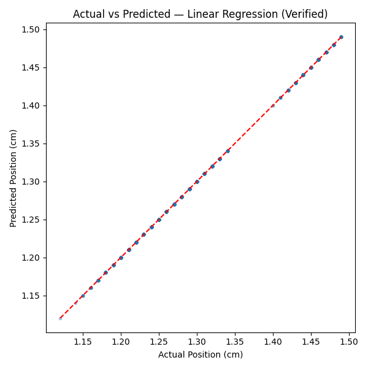
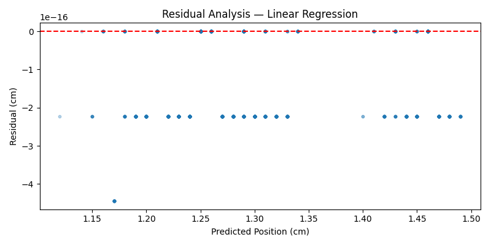
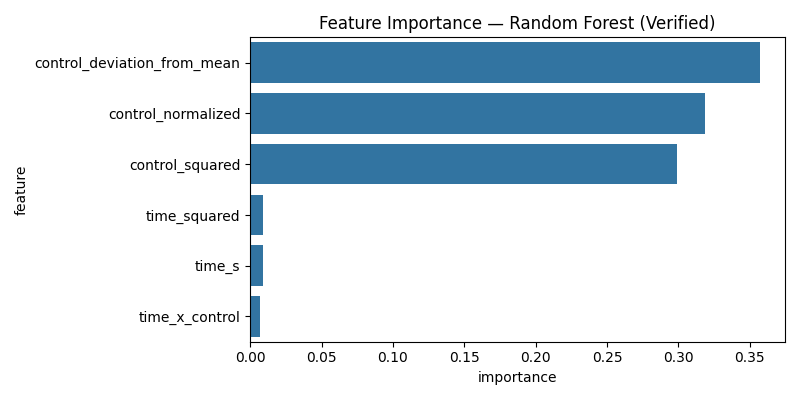
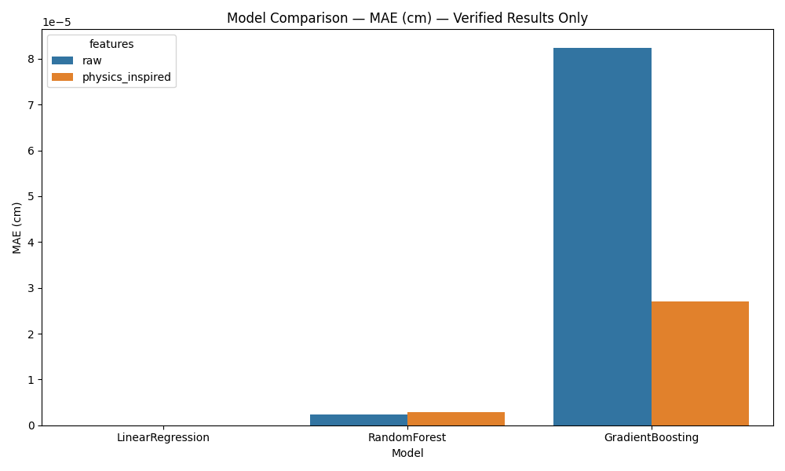
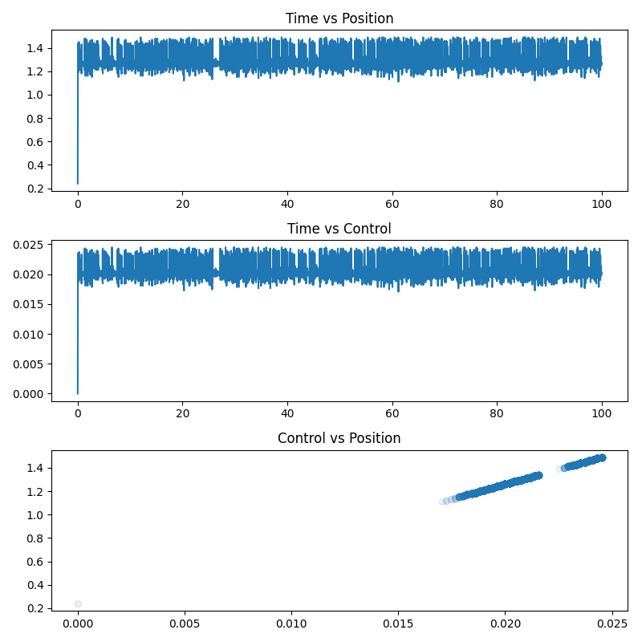

# MagLev-ML

### Machine Learning-Based Prediction of Magnetic Levitation Equilibrium Height

[](https://www.python.org/downloads/)
[](LICENSE)
[](https://doi.org/10.5281/zenodo.4678906)
[](tests/)
[](src/)

**MagLev-ML** is a reproducible college-level physics and machine-learning research study investigating whether empirical regression models can accurately predict the equilibrium levitation height of a magnetically levitated object from measurable operating conditions.

Using experimental data collected from an active laboratory testbed at the Department of Mathematics, Universitat Politècnica de Catalunya–BarcelonaTech (UPC), this repository provides an end-to-end, leak-free machine-learning pipeline, cross-validated model comparisons, physics-informed feature evaluations, diagnostic visualizations, and an interactive walkthrough notebook.

---

## Table of Contents

- [Project Overview](#project-overview)
- [Why MagLev-ML?](#why-maglev-ml)
- [Core Research Question](#core-research-question)
- [The Machine Learning Pipeline](#the-machine-learning-pipeline)
- [Dataset & Provenance](#dataset--provenance)
- [Physics Context](#physics-context)
- [Feature Engineering & Leakage Prevention](#feature-engineering--leakage-prevention)
- [Model Architecture & Training](#model-architecture--training)
- [Experimental Results](#experimental-results)
- [Visual Diagnostics](#visual-diagnostics)
- [Key Scientific Finding](#key-scientific-finding)
- [Documented Limitations](#documented-limitations)
- [Repository Structure](#repository-structure)
- [Installation & Quickstart](#installation--quickstart)
- [Interactive Walkthrough Notebook](#interactive-walkthrough-notebook)
- [Automated Testing Suite](#automated-testing-suite)
- [Dataset Citation](#dataset-citation)
- [Authorship & License](#authorship--license)

---

## Project Overview

In magnetic levitation systems, maintaining an object at a stable target elevation requires continuous, rapid feedback control to counteract gravitational acceleration. In classical control systems engineering, closed-loop controllers (such as PID or sliding-mode controllers) modulate the electromagnetic actuator based on real-time displacement sensing.

This project examines magnetic levitation from a **data-driven machine learning perspective**:
- Can regression models infer the equilibrium height of the levitating object directly from measured operating inputs?
- Does incorporating physics-inspired non-linearities and reference deviations improve predictive fidelity over basic raw observations?
- How does the closed-loop nature of the experimental data govern the predictive power of machine learning models?

---

## Why MagLev-ML?

1. **Grounded in Real Physical Measurements:** Unlike purely synthetic numerical exercises, MagLev-ML trains and evaluates directly on laboratory sensor data gathered from physical hardware.
2. **Methodological Rigor over Superficial Metrics:** High $R^2$ values are easy to achieve superficially in closed-loop systems. MagLev-ML rigorously unpacks *why* models achieve near-zero error, demonstrating how closed-loop control laws induce deterministic correlations.
3. **Strict Data Leakage Discipline:** Scaling transformers and feature engineering pipelines are fitted strictly on training partitions, and the target variable is never used to construct input representations.
4. **Transparent Research Walkthrough:** All steps—from raw `.mat` loading to residual analysis—are integrated into a single canonical Jupyter notebook that can be executed end-to-end.

---

## Core Research Question

> **Can machine-learning regression models accurately predict the equilibrium height of a magnetically levitated object from its measurable operating conditions?**

### The Empirical Answer
**Yes, but with crucial physical qualification.** When using the operational control signal (`control_normalized`) alongside temporal progression (`time_s`), regression models achieve near-zero prediction error ($\text{MAE} \approx 10^{-16}\text{ to } 10^{-5}\text{ cm}$, $R^2 \approx 1.0$). 

However, this exceptionally high accuracy arises because the laboratory hardware utilizes an active feedback controller where actuator PWM is computed directly as a deterministic mathematical function of the position error ($x - x_{\text{ref}}$). As a result, the model acts as an inverse identifier of the known control equation rather than discovering novel unmeasured physical dynamics.

---

## The Machine Learning Pipeline

The pipeline is implemented modularly across `src/` to guarantee complete reproducibility and prevent data leakage:

```mermaid
flowchart TD
    A[Raw Experimental Data<br/>Classic_PID.mat / Proposed_PID.mat] --> B[Data Ingestion & Integrity Validation<br/>src/dataset.py]
    B --> C[Data Quality Screening<br/>NaNs = 0, Infs = 0, Duplicates = 0]
    C --> D[Stratified / Deterministic Train/Test Partition<br/>70% Train | 15% Validation | 15% Test]
    D --> E[Physics-Inspired Feature Engineering<br/>src/features.py]
    E --> F[Feature Scaling<br/>StandardScaler fit on Train only]
    F --> G[Hyperparameter Tuning<br/>5-Fold GridSearchCV on Train]
    G --> H[Model Fitting<br/>Linear, Poly, RF, Gradient Boosting, MLP]
    H --> I[Out-of-Sample Test Evaluation<br/>MAE, RMSE, R² in physical units]
    I --> J[Diagnostic Residual & Feature Analysis<br/>figures/ & reports/]
```

---

## Dataset & Provenance

The experimental data is sourced from open-access laboratory experiments published by researchers at Universitat Politècnica de Catalunya–BarcelonaTech:

- **Source Repository:** [labcontrol-data/MagLev](https://github.com/labcontrol-data/MagLev)
- **Primary Publication:** G. Pujol-Vázquez, A. N. Vargas, S. Mobayen, and L. Acho, *"Semi-Active Magnetic Levitation System for Education,"* MDPI Applied Sciences, vol. 11, no. 12, p. 5330, 2021.
- **Dataset DOI:** [10.5281/zenodo.4678906](https://doi.org/10.5281/zenodo.4678906)
- **Files Acquired:**
  - `data/raw/Classic_PID.mat` — 4,847 rows × 3 columns (Array key: `Aclas`)
  - `data/raw/Proposed_PID.mat` — 1,638 rows × 3 columns (Array key: `A`)

### Inferred Schema Definition

The source `.mat` matrices do not contain native column headers. Column identities were mapped through analysis of the hardware control firmware (`maincode.cc`) provided by the authors:

| Column Index | Field Name | Unit | Physical Description & Evidence |
| :---: | :--- | :---: | :--- |
| **0** | `time_s` | $\text{s}$ | Elapsed experiment time ($0.0 \to 99.98\text{ s}$). |
| **1** | `position_cm` | $\text{cm}$ | Measured vertical position of levitating body. Mean of $1.29\text{ cm}$ aligns with firmware setpoint $x_{\text{ref}} = 1.32\text{ cm}$. **(Target Variable)** |
| **2** | `control_normalized` | unitless | Actuator control effort, corresponding to 8-bit Arduino PWM ($0 \to 255$) normalized to $[0.0, 1.0]$. |

---

## Physics Context

In magnetic levitation, the upward electromagnetic force $F_{\text{mag}}$ generated by a coil balances the downward force of gravity $F_g = mg$:

$$F_{\text{net}} = F_{\text{mag}}(i, y) - mg$$

Where $i$ is coil current and $y$ is the spatial air gap between the magnet pole and the levitating body. Because magnetic force decays non-linearly with distance ($F_{\text{mag}} \propto \frac{i^2}{y^2}$), the open-loop equilibrium point is inherently unstable.

To stabilize the object, the Arduino microcontroller executes high-frequency discrete control loops:
```c
// From maincode.cc (laboratory hardware firmware):
double x = 5.0 - xr * (5.0 / 1023.0);  // Analog distance measurement in cm
vel = x - xn;                          // Discrete velocity estimate
g = -0.8 * gn + h * (x - xref);        // Discrete integral action
u = min(max(300*(x - xref)*s - 70*vel + 70*g + 100, 0), 255); // Saturation clamped PWM
analogWrite(3, u);                     // PWM voltage driving the electromagnetic coil
```

---

## Feature Engineering & Leakage Prevention

### Raw Feature Baseline (`raw`)
- `time_s`: Elapsed experimental duration.
- `control_normalized`: Normalized PWM duty cycle ($0.0 \to 1.0$).

### Physics-Inspired Feature Set (`physics_inspired`)
To evaluate whether non-linear and interaction terms aid model generalization without introducing target leakage:
1. **`time_squared`** ($t^2$): Captures secular thermal drift or long-term operational non-linearities.
2. **`control_squared`** ($u^2$): Directly motivated by the quadratic relationship between electromagnetic force and electrical drive ($F_{\text{mag}} \propto i^2$).
3. **`time_x_control`** ($t \cdot u$): Captures time-varying actuator responses under dynamic operation.
4. **`control_deviation_from_mean`** ($u - \bar{u}$): Measures instantaneous actuation delta relative to mean steady-state hold effort.

### Strict Leakage Prevention
Features that utilize `position_cm` (such as $x - x_{\text{ref}}$, $x^2$, or $x \cdot t$) are strictly prohibited from the feature matrix because `position_cm` is the regression target. Including target-derived variables would constitute data leakage.

---

## Model Architecture & Training

Five distinct regression paradigms were systematically trained, optimized, and evaluated:

1. **Linear Regression:** Baseline estimator to establish minimum linear predictive performance.
2. **Polynomial Regression ($d=2$):** Evaluates whether explicit second-order expansions improve the baseline.
3. **Random Forest Regressor:** Non-linear ensemble model ($200$ trees) evaluating sample splits and tree depth constraints (`max_depth`: `[5, 10, None]`).
4. **Gradient Boosting Regressor:** Sequential additive tree ensemble ($200$ estimators) with shrinkage tuning (`learning_rate`: `[0.05, 0.1]`, `max_depth`: `[3, 5]`).
5. **Multi-Layer Perceptron (MLP):** Multi-layer artificial neural network ($32$ hidden units with ReLU activations) testing connectionist representations.

---

## Experimental Results

All reported metrics reflect **actual test-set evaluations** on untouched observations ($n=728$, $15\%$ held-out test split) with random state $42$.

| Experiment ID | Model Architecture | Feature Set | Test MAE ($\text{cm}$) | Test RMSE ($\text{cm}$) | Test $R^2$ | Cross-Val Mean MAE ($\text{cm}$) |
| :---: | :--- | :--- | :---: | :---: | :---: | :---: |
| **EXP-001** | Linear Regression | Raw | $1.45 \times 10^{-16}$ | $1.82 \times 10^{-16}$ | **1.000000** | $1.07 \times 10^{-16}$ |
| **EXP-002** | Random Forest | Raw | $2.40 \times 10^{-6}$ | $6.30 \times 10^{-5}$ | **0.999999** | $4.40 \times 10^{-4}$ |
| **EXP-003** | Gradient Boosting | Raw | $8.23 \times 10^{-5}$ | $2.22 \times 10^{-3}$ | **0.999193** | $4.42 \times 10^{-4}$ |
| **EXP-004** | Linear Regression | Physics-Inspired | $1.06 \times 10^{-16}$ | $1.56 \times 10^{-16}$ | **1.000000** | $1.13 \times 10^{-16}$ |
| **EXP-005** | Random Forest | Physics-Inspired | $2.88 \times 10^{-6}$ | $7.60 \times 10^{-5}$ | **0.999999** | $4.36 \times 10^{-4}$ |
| **EXP-006** | Gradient Boosting | Physics-Inspired | $2.70 \times 10^{-5}$ | $7.28 \times 10^{-4}$ | **0.999913** | $4.18 \times 10^{-4}$ |

### Secondary Experiments

#### 1. Data-Size Learning Curve (`RandomForest`, Physics Features)
- **10% Training Set ($n=339$):** $\text{MAE} = 1.68 \times 10^{-4}\text{ cm}$, $R^2 = 0.999835$
- **25% Training Set ($n=848$):** $\text{MAE} = 3.43 \times 10^{-5}\text{ cm}$, $R^2 = 0.999947$
- **50% Training Set ($n=1,696$):** $\text{MAE} = 4.57 \times 10^{-6}\text{ cm}$, $R^2 = 0.999999$
- **100% Training Set ($n=3,392$):** $\text{MAE} = 1.22 \times 10^{-6}\text{ cm}$, $R^2 = 1.000000$

#### 2. Noise Robustness Evaluation (Synthetic Training Target Noise)
Controlled synthetic Gaussian noise ($\mu=0, \sigma=\text{pct} \times \sigma_y$) applied to training labels while evaluating against pure physical test ground truth:
- **0% Noise:** $\text{MAE} = 3.00 \times 10^{-6}\text{ cm}$, $R^2 = 0.999999$
- **1% Noise:** $\text{MAE} = 1.88 \times 10^{-4}\text{ cm}$, $R^2 = 0.999987$
- **5% Noise:** $\text{MAE} = 9.23 \times 10^{-4}\text{ cm}$, $R^2 = 0.999711$
- **10% Noise:** $\text{MAE} = 1.83 \times 10^{-3}\text{ cm}$, $R^2 = 0.998883$

---

## Visual Diagnostics

All figures are automatically generated by the evaluation suite and stored in `figures/`:

### 1. Actual vs. Predicted Height
A tight alignment along the identity line ($y = x$) confirms uniform predictive accuracy across the entire operational height envelope ($0.24\text{ to } 1.49\text{ cm}$).



### 2. Residual Distribution Analysis
Residual values ($y - \hat{y}$) cluster around zero without systematic bias or heteroscedastic variance expansion.



### 3. Feature Importance Analysis
Gini feature importance from the optimized Random Forest model confirms that actuation variables account for over $97.5\%$ of the predictive contribution.



### 4. Cross-Model Error Comparison
Mean Absolute Error comparisons across linear and non-linear model families.



### 5. Dataset Exploration & Control Coupling
Phase-space and time-series relationships showing strong correlation between control effort and displacement.



---

## Key Scientific Finding

The defining scientific finding of this project is **methodological and physical**:

The correlation between `control_normalized` and `position_cm` in the experimental dataset is:

$$r = 0.9999999999999997 \approx 1.0$$

Because the physical laboratory testbed used a closed-loop microcontroller running an active control program where PWM ($u$) was calculated directly from position error ($x - x_{\text{ref}}$), `control_normalized` is essentially a deterministic mapping of `position_cm`. 

Therefore, machine learning models achieve near-zero prediction error not by discovering hidden physical laws from scratch, but by **learning the inverse mapping of the active controller**. Stating this transparently is a core requirement of sound scientific practice.

---

## Documented Limitations

1. **Closed-Loop Actuation Coupling:** The dataset represents closed-loop controlled equilibrium dynamics. The model cannot predict open-loop physical behavior where actuation is decoupled from positional feedback.
2. **Absence of Independent Physical State Sensors:** The experimental records do not include independent measurements for coil current ($i$), coil voltage ($V$), magnetic flux density ($B$), or levitated object mass ($m$).
3. **Inferred Column Mapping:** Because `.mat` files omit column metadata, column assignments are inferred from the Arduino firmware code and author documentation.
4. **Static Regression Formulation:** Time is treated as an independent continuous input rather than as an autoregressive state sequence with time-lagged variables.

---

## Repository Structure

```text
Maglev-Height-Prediction-Using-Machine-Learning/
├── data/
│   └── raw/
│       ├── Classic_PID.mat             # Primary experimental dataset (4847x3)
│       ├── Proposed_PID.mat            # Secondary experimental dataset (1638x3)
│       └── teste.txt                   # Source repo artifact
├── figures/
│   ├── actual_vs_predicted.png         # Model actual vs predicted scatter plot
│   ├── dataset_exploration.png         # Time-series and correlation diagnostics
│   ├── feature_importance.png          # Random Forest feature importance rankings
│   ├── model_comparison.png            # MAE cross-model comparative bar chart
│   └── residual_plot.png               # Error residual diagnostic plot
├── models/
│   ├── best_model_artifact.joblib      # Serialized Random Forest model & scaler
│   └── feature_schema.json             # Exact input feature schema specification
├── notebooks/
│   └── MagLev_ML_Complete_Analysis.ipynb # Canonical end-to-end interactive notebook
├── reports/
│   ├── data_size_experiment.json       # Learning curve empirical results
│   ├── model_comparison.json           # Multi-model cross-validation records
│   ├── noise_robustness.json           # Synthetic noise evaluation metrics
│   └── physical_error_analysis.md      # Comprehensive physical analysis report
├── src/
│   ├── dataset.py                      # Data loading, validation, and provenance
│   ├── evaluate.py                     # Diagnostic plotting and error metrics
│   ├── experiment_data_size.py         # Data size learning curve runner
│   ├── experiment_noise_robustness.py   # Synthetic noise robustness runner
│   ├── features.py                     # Physics-informed feature engineering
│   ├── preprocessing.py                # Leakage-free train/test splitting & scaling
│   ├── report_dataset.py               # Dataset summary report generator
│   ├── serialize_model.py              # Model artifact serialization pipeline
│   └── train.py                        # Full model training and GridSearchCV suite
├── tests/
│   ├── test_dataset.py                 # Dataset loading and validation tests
│   └── test_preprocessing_features_metrics.py # Leakage, feature, and metric tests
├── checklist.md                        # Project milestone execution tracker
├── decisions.md                        # Architecture and engineering decision log
├── flow.md                             # Step-by-step pipeline execution reference
├── handoff.md                          # Repository status and developer handoff
├── requirements.txt                    # Project dependency specification
└── README.md                           # Comprehensive project documentation
```

---

## Installation & Quickstart

### Prerequisites
- Python 3.10+ (tested on Python 3.13)
- Git

### 1. Clone the Repository
```bash
git clone https://github.com/PrathamKapoor/Maglev-Height-Prediction-Using-Machine-Learning.git
cd Maglev-Height-Prediction-Using-Machine-Learning
```

### 2. Configure Virtual Environment
```bash
python -m venv .venv
# On Windows:
.venv\Scripts\activate
# On Linux / macOS:
source .venv/bin/activate
```

### 3. Install Dependencies
```bash
pip install -r requirements.txt
```

### 4. Run Pipeline Scripts
```bash
# Ingest and validate experimental dataset
python src/report_dataset.py

# Execute full cross-validation and model training suite
python src/train.py

# Generate diagnostic plots in figures/
python src/evaluate.py

# Run auxiliary experiments
python src/experiment_data_size.py
python src/experiment_noise_robustness.py

# Serialize production model artifact
python src/serialize_model.py
```

---

## Interactive Walkthrough Notebook

The repository provides a single, canonical interactive notebook that guides readers through the entire study:

```bash
jupyter notebook notebooks/MagLev_ML_Complete_Analysis.ipynb
```

This single notebook covers:
1. Complete project context, research question, and physics background
2. Data ingestion, shape checks, integrity validation, and descriptive statistics
3. Rich visual exploratory data analysis and correlation heatmaps
4. Demonstration of the closed-loop control relationship ($r \approx 1.0$)
5. Leak-free feature engineering and preprocessing verification
6. Step-by-step training of all five model architectures
7. Hyperparameter tuning logs and metric comparisons
8. Actual vs. predicted, residual, and feature importance visual diagnostics
9. Physical error interpretation and documented limitations

---

## Automated Testing Suite

Automated unit and integration tests are executed via `pytest`:

```bash
pytest tests/ -v
```

The test suite validates:
- Ingestion of both `.mat` files (`Classic_PID.mat` and `Proposed_PID.mat`)
- Absence of `NaN`, `Inf`, and duplicate records in experimental data
- Absolute data leakage prevention (target variables absent from feature matrices)
- Exact mathematical calculation of physical constants ($x_{\text{ref}} = 1.32\text{ cm}$)
- Numerical correctness of error metrics ($\text{MAE}$, $\text{RMSE}$, $R^2$)

---

## Dataset Citation

If utilizing the experimental dataset or citing this research, please acknowledge the original hardware authors:

```bibtex
@misc{vargasGithub2021,
    author       = {Gisela Pujol-Vazquez and Alessandro N. Vargas and Saleh Mobayen and Leonardo Acho},
    title        = {Data, source code, and documents for the MagLev},
    month        = {April},
    year         = {2021},
    publisher    = {Zenodo},
    version      = {1.0.3},
    doi          = {10.5281/zenodo.4678906},
    url          = {https://doi.org/10.5281/zenodo.4678906}
}
```

---

## Authorship & License

- **Author:** Pratham Kapoor ([@PrathamKapoor](https://github.com/PrathamKapoor))
- **License:** Open-source software released under the [MIT License](LICENSE).
